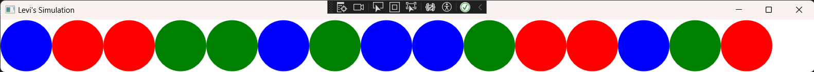
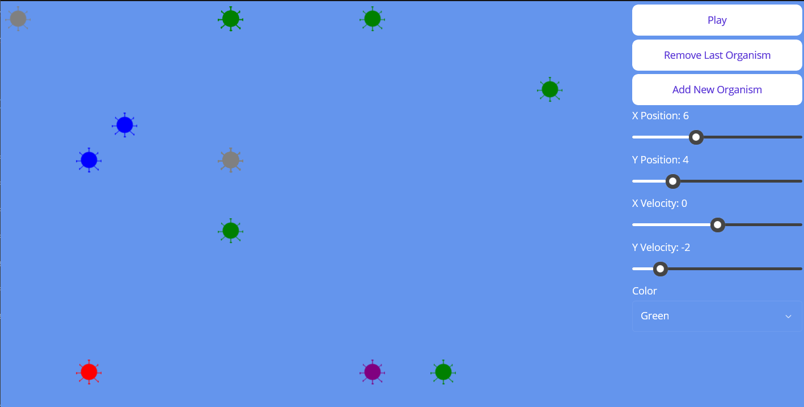

# Simulations

A collection of "Levi's simulations" similar to the Primer YouTube channel:

https://www.youtube.com/@PrimerBlobs

Folders:

* `1D`: simplest simulation with organisms that live in a 1-dimensional plane: a
  linked list. Contains a console app and WPF app.

* `2D`: slightly more complicated simulation with organisms that live in
  2-dimensional space. Contains a .NET MAUI app that works best on devices with
  larger screens like desktop or tablets.

